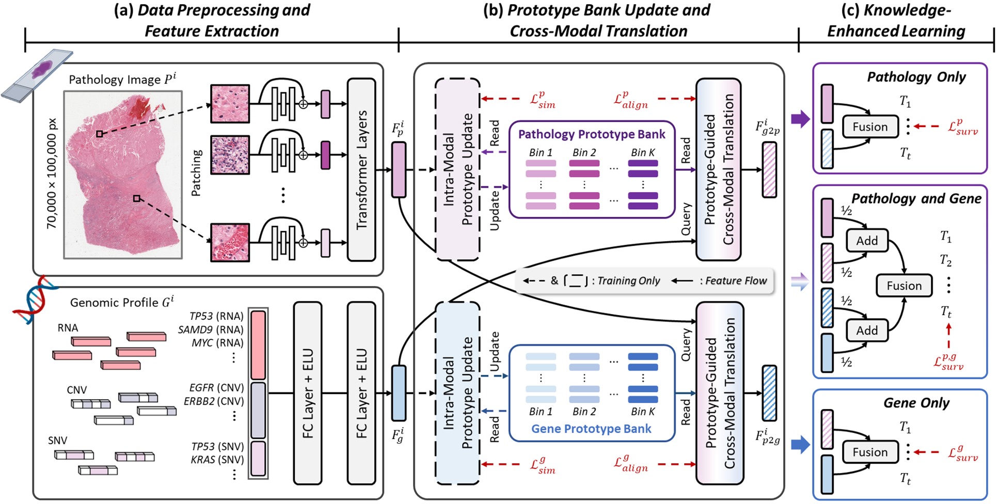

# ProSurv: Prototype-Guided Cross-Modal Knowledge Enhancement for Adaptive Survival Prediction

[](https://your-paper-link.com) 
[](LICENSE)


---

## 🔍 Overview

Histo-genomic multimodal survival prediction has garnered growing attention for its remarkable model performance and potential contributions to precision medicine. However, a significant challenge in clinical practice arises when only unimodal data is available, limiting the usability of these advanced multimodal methods. 

To address this issue, we propose **ProSurv**, a prototype-guided cross-modal knowledge enhancement framework. ProSurv learns modality-specific prototype banks to capture survival-critical features and transfers knowledge across modalities via prototype-guided feature translation and alignment. This enables robust prediction with both unimodal and multimodal inputs, effectively eliminating the dependency on paired data.



---

## 🚀 Getting Started

### 1. Data Preprocessing

#### Whole Slide Images (WSIs)
1. **Download:** Obtain WSIs from [TCGA](https://portal.gdc.cancer.gov).
2. **Feature Extraction:** We follow [CLAM](https://github.com/mahmoodlab/CLAM) to preprocess WSIs. Patch features (256 × 256, 20x) are extracted using the pre-trained [UNI](https://github.com/mahmoodlab/UNI) model and saved as `.pt` files.

#### Genomics
We use the preprocessed genomic data provided in the `datasets_csv` folder from [SurvPath](https://github.com/mahmoodlab/SurvPath).

### 2. Training and Testing
We provide a convenient shell script to run the experiments. Configure your hyperparameters in the script and execute:

```bash
bash scripts/prosurv.sh
```

---

## 🙏 Acknowledgement

We sincerely thank the authors of the following repositories for their open-source contributions:
* [CLAM](https://github.com/mahmoodlab/CLAM)
* [SurvPath](https://github.com/mahmoodlab/SurvPath)
* [UNI](https://github.com/mahmoodlab/UNI)
* [TransMIL](https://github.com/szc19990412/TransMIL)

---

## 📖 Publication
Our paper **"ProSurv: Prototype-Guided Cross-Modal Knowledge Enhancement for Adaptive Survival Prediction"** has been accepted by **MICCAI 2025**. 

If you find this project useful, please consider citing our work:

```bibtex
@inproceedings{liu2025prototype,
  title={Prototype-guided cross-modal knowledge enhancement for adaptive survival prediction},
  author={Liu, Fengchun and Cai, Linghan and Wang, Zhikang and Fan, Zhiyuan and Yu, Jin-gang and Chen, Hao and Zhang, Yongbing},
  booktitle={International Conference on Medical Image Computing and Computer-Assisted Intervention},
  pages={522--532},
  year={2025},
  organization={Springer}
}
```