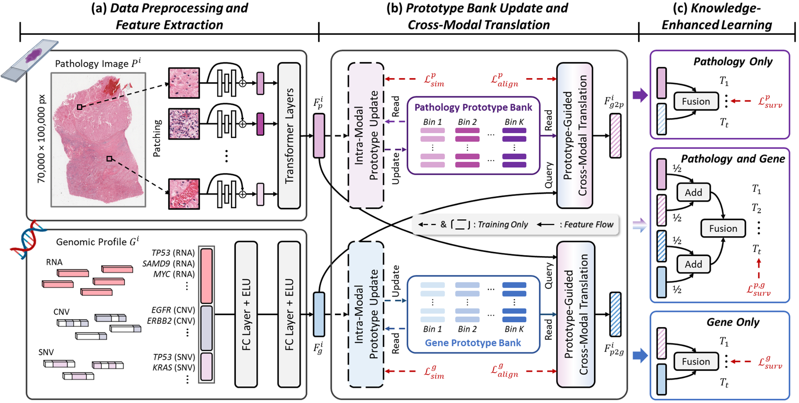

# ProSurv: Prototype-Guided Cross-Modal Knowledge Enhancement for Adaptive Survival Prediction


## Overview

>Histo-genomic multimodal survival prediction has garnered growing attention for its remarkable model performance and potential contributions to precision medicine. However, a significant challenge in clinical practice arises when only unimodal data is available, limiting the usability of these advanced multimodal methods. To address this issue, we proposes a prototype-guided cross-modal knowledge enhancement (ProSurv) framework, which learns modality-specific prototype banks to capture survival-critical features and transfers knowledge across modalities via prototype-guided feature translation and alignment, enabling robust prediction with both unimodal and multimodal inputs. As a result, ProSurv eliminates the dependency on paired data and enables robust learning and adaptive survival prediction. Overall, ProSurv addresses a critical practical challenge in computational pathology, offering substantial significance and potential impact in the field.



## Data Preprocess
### WSIs
>#### 1. Download WSIs
>>Download WSIs from [TCGA](https://portal.gdc.cancer.gov).
>#### 2. Preprocess WSIs
>>We follow the [CLAM](https://github.com/mahmoodlab/CLAM) to preprocess the WSIs and extract feature for each 256 × 256 patch (20x) based on pretrained [UNI](https://github.com/mahmoodlab/UNI) model. The extracted feature is saved as `.pt` file.

### Genomics
>In this work, We directly use the preprocessed genomic data in the `datasets_csv` folder from the [SurvPath](https://github.com/mahmoodlab/SurvPath).

## Training and Testing
>We provide the training and testing script `prosurv.sh` in the `scripts` folder. Set the parameter and run it.

```bash
bash scripts/prosurv.sh
```
## Acknowledgement
>We would like to thank the following  repositories for their great work.

>+ [CLAM](https://github.com/mahmoodlab/CLAM)
>+ [SurvPath](https://github.com/mahmoodlab/SurvPath) 
>+ [UNI](https://github.com/mahmoodlab/UNI) 
>+ [TransMIL](https://github.com/szc19990412/TransMIL) 